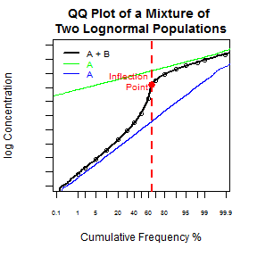

## Determining Population Parameters for Mixtures of Normal Distributions

With most environmental and/or geologic samples, it is fairly rare to obtain samples that are comprised of a single population. For example, 
- soil at a site may contain background levels of a particular analyte and also be contaminated by an anthropogenic source of the same analyte.
- ore may contain veinlets of pure mineral (e.g., copper) and other material with lower concentrations of the analyte of interest.

In order to obtain accurate estimates of the parameters of interest (i.e., the degree of contamination due to anthropogenic activities, the average grade of a precious metal deposit), it is essential to be able to identify and characterize the subpopulations (e.g., background versus contaminated) within a given data set.

While the importance of accurately characterizing the subpopulations within a data set is clearly recognized within the mining industry (where the misclassification of recoverable grade and tonnage can lead to significant economic losses), it is much less recognized within the field of environmental remediation. 
- As a result, many environmental professionals are not aware of relatively basic techniques that can be used to characterize these populations and few tools have been developed to assist these professionals with this type of analysis.

--- .class #id 

## Normal Distributions and Mixtures of Normal Distributions

While the distributions of concentration data for many analytes of environmental concern (e.g., metals such as arsenic and lead) or minerals of economic significance (e.g., gold) are rarely normally distributed. Nevertheless, they commonly approximate lognormal distributions and can be modeled as normal distributions after log-transforming the data.

 

Plot 4 panel plot of a single population, non-overlapping, slightly overlapping, high degree of overlapping populations. Maybe with different standard deviations?

Using QQ Plots, or cumulative frequency plots, one can determine the approximate composition of a mixture of normal distributions. In a QQ Plot, a normal distribution plots as a straight line, with the slope being proportional to the standard deviation of the population and the intercept the mean of the population. When you have a 50:50 mixture of two normally distributed populations, or a mixture of three normally distributed populations as shown in the figure below, the resulting plot looks like an S... Such mixtures produce curved patterns on QQ Plots.  Similar patterns are commonly interpreted to consist of two or more overlapping subpopulations. The central parto f hte curve contains an inflection point (change in direction of curvature), indicating the possible presence of multiple normal subpopulations, In theory, there is one more subpopulation than there are inflection points, however, sampling and analytical error generally limit the recognition of more than three or four subpopulations in a data set.

Plot 4 panel plot showing individual populations, non-overlapping mixture, slightly overlapping mixture of two, and highly overlapping mixture of three populations?

--- .class #id 

## Partitioning

Partitioning is the term applied to procedures to separate the cumulative curve of a mixture of subpopulations into the component subpopulations. By identifying the inflection points in a QQ Plot of the normal data, we can partition the mixture of subpopulations into its component subpopulations. This is accomplished using the `normalmixEM` function in the `mixtools` package which uses maximum-likelihood estimation procedures on an [expectation-maximization](http://en.wikipedia.org/wiki/Expectation%E2%80%93maximization_algorithm) algorithm, to determine the population parameters of the component subpopulations within the mixture.

--- .class #id 

## Introduction to Application

XXXX

[Application](https://jmbekd.shinyapps.io/Developing_Data_Projects/)

--- .class #id 

## Embed the Shiny Application

Maybe.

--- .class #id 
